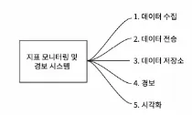

# 1단계 : 문제 이해 및 설계 범위 확정

정확한 요구사항을 알아내는 것이 중요하다. 애초에 지표 모니터링 및 경보 시스템의 의미가 다양하기 때문이다. 어떤 지표를 모니터링 하는지, 어떤 것을 알림을 줘야하는지

인프라 지표, 웹 서버 에러 로그, 엑세스 로그 처럼 모니터링 대상이 다양하다.

그럼 어떤 질문들을 던져야 할까?

- 시스템의 고객
- 모니터링할 지표
- 인프라 규모
- 데이터 유지 기간
- 정보 채널( 어떤 것으로 내보낼 것인지)
- 로그 수집 여부
- 분산 시스템 추적 기능 여부

정말 다양한 요구사항이 있을 수 있다. 이것들에서 전부는 아니더라도 자신이 알고 있는 선, 내가 설명할 수 있는 기술들의 커버 범위 내에서는 질문을 던지는 것이 좋다.

# 2단계 : 개략적 설계안 제시

시스템 구축을 위해 기본적인 것들은 무엇이 있을 까?

1. 데이터 수집 : 여러 출처로부터 지표 데이터를 수집한다. 
2. 데이터 전송 : 지표 데이터를 지표 모니터링 시스템으로 전송한다. 
3. 데이터 저장소 : 전송되어 오는 데이터를 정리하고 저장한다. 
4. 경보 : 밀려오는 데이터를 **분석하고** 이상 징후를 감지하고, 경보를 발생시킨다. 
5. 시각화 : 데이터를 차트나 그래프 등으로 제공한다. 

그러면 **데이터 모델**은 어떤 것이 있을까? 

우선 먼저 생각을 해보자 지표 데이터는 어떠한 모습이여야 할까? 
그러면 이 절의 제목부터 살펴보는 것이 좋을 것이다. “지표 모니터링 및 경보 시스템”이다. 여기서 말하는 지표는 시간 축이 필요하다. 왜냐하면 모니터링이기 때문이다. 

그럼 데이터 모델은 시간 축을 가지고 있어야한다. 

시간 축을 가지고 있는 데이터 모델로 시계열 데이터가 있다. 시계열 데이터는 값 집합을 y 값으로 가지고 x축이 시간인 데이터를 말한다. 어려울 것없다. 즉, 시간과 값의 지표라는 말이다. 

시계열 데이터의 예시이다. 프로덕션에서 사용 중인 서버 i631의 20:00 시점의 CPU 부하를 알고 싶은 것이다.

시계열 데이터는 지표 이름, 레이블, 타임스탬프 시각에 찍힌 value 값으로 구성이 되어있다.

여기 까지 시계열 데이터가 무엇인지 알았다. 시계열 데이터로 지표를 간단하게 나타내었지만 시계열 데이터를 이용해 연산하고 managing 하는 것은 여간 쉬운 작업이 아니다.

위의 예시는 특정 시점에서 특정 지표의 값을 알고 싶어 바로 나오지만 레이블 정보의 일부분을 발췌하여 그 레이블 속에서 평균 값이나 범위 측정을 사용하게 되면 난이도는 매우 올라간다.

**데이터 접근 패턴**

보통 지표 모니터링 및 경보 시스템은 쓰기 부하가 꾸준히 크고 반면 읽기 부하는 특정 시점에만 높아진다. 당연한 것이다. 모니터링이기 때문에 쓰기는 지속적으로 발생하지만 읽기는 특정 시점에 값을 불러들이는 것이기에 단발적으로 치솟게 된다 

이러한 복잡한 구조를 잘 다룰 수 있는 데이터 저장소 시스템이 있을까?

1. RDBMS
    1. RDBMS는 시계열 데이터를 처리할 수 있지만 시계열 데이터 연산에 최적화 되어있지 않다. 
    2. 예를 들어 시계열 데이터의 지수 이동 평균 값을 지속적으로 갱신하는 질의문을 SQL로 작성한다고 하면 복잡해서 읽기가 까다롭고 
    3. 태크/레이블에 대한 질의를 지원하려면 태그마다 인덱스를 지정해야한다.
    4. 그리고 애초에 범용 관계형 데이터베이스는 많은 양의 쓰기 연산이 지속적으로 발생하는 환경에서 좋은 성능을 내지 못한다. 
2. NoSQL
    1. 카산드라나 빅테이블 같은 NoSQL 데이터베이스를 사용하면 시계열 데이터를 효율적으로 처리할 수 있기는 하나 효율적으로 데이터를 처리하기 위해서는 해박한 스키마 지식이 필요하다.

위 두가지는 대표적인 데이터 베이스이다. 

그럼 대체 뭘 써야할까? 답은 허무하도록 간단하다 시계열에 특화되어있는 시계열 데이터 베이스를 쓰면 된다. 그러니까 너가 원래 쓰고 있는 RDB와 Nosql 이외에 데이터베이스를 추가하면 된다는 것이다.

시장에서 유명한 데이터베이스로는

프로메테우스가 있다. 

시계열 데이터베이스는 아까 관계형 데이터베이스의 한계였던 태그, 레이블 단위 질의를 효율적으로 할 수 있다. 레이블 기반의 신속한 데이터 질의를 지원하기 위해 레이블 별로 인덱스를 자동 구축해주기 때문이다. 

그렇기 때문에 레이블을 이용할 때 데이터베이스가 과부화가 걸리지 않도록 각 레이블이 가질 수 있는 값의 가짓수 즉 Cardinality가 낮아야 하는 것이다. 

데이터 모델인 시계열 데이터 모델에 많은 비중을 할애 했다. 이제 진짜 지표 모니터링, 경보 시스템의 개략적 설계안을 살펴볼 차례이다.

개략적인 설계안은 아래와 같다.

그림을 보면 왜 시계열 데이터베이스를 중점있게 설명했는지 알것이다. 시계열 데이터 베이스를 지표 모니터링 및 경보 시스템의 기준이라고 생각하면 된다. 

모니터링으로 정보를 시계열 데이터베이스에 저장을 하고 경보를 알려주기 위해 저장된 정보를 읽어들이는 것이니 말이다.

질의 시스템이 보이는데 이는 단순히 시계열 데이터베이스에 질의를 날리는 것을 도와 주는 부분이다. 아까 살펴봤듯 프로메테우스나 influx 같은 좋은 시계열 데이터 베이스를 사용하게 되면 질의 시스템은 할게 많이 줄어든다.

# 3단계 : 상세 설계

## 지표 수집

지표를 수집하는 방법에는 두가지가 존재한다. 

바로 풀 모델과 푸시 모델이다.

모니터링에서 pull 모델과 push 모델은 자주 나오는 주제이다. Devops에서 CICD 에서도 등장한다. 살펴보도록 하자

**Pull model**

지표 수집으로 pull model을 사용한다고 하면 지표 수집기 서버 안에 모든 서비스 엔드포인트의 DNS/IP 정보를 담은 파일이 필요하다. (소규모) 그래야 내가 서비스들에서 정보를 땡겨올테니 말이다. 

대규모에서는 etcdsk 아파치 주키퍼 같은 서비스 탐색 기술을 사용해야한다.

수천대 서버가 만들어 내는 지표 데이터를 수집하려면 지표 수집기 서버 한대로는 부족하다. 

→ 지표 수집기 서버 풀을 만들어야 한다. 즉, 지표 수집 서버 간의 모종의 중재 메커니즘이 존재해야 한다는 것이다. 

“해시링” : 중재 매커니즘을 구현하는 방안이다. 

해시링 구간마다 해당 구간에 속한 서버로부터 생산되는 지표의 수집을 담당하는 수집기 서버를 지정하는 것이다. 

이렇게 하면 특정 서버의 지표 데이터는 항상 하나의 수집 서버가 처리함을 보장할 수 있다. 즉, 여러 대에 서버가 존재했을 때 발생할 수 있는 중복 수집의 문제를 해결하는 것이다. 풀 모델의 유명한 사례로는 프로메테우스가 있다.

그 다음으로 살펴볼 것은 푸시모델이다. 

풀 모델에서는 지표 수집기가 지표 출처를 방문하면서 정보를 받아왔지만 푸시 모델은 지표 출처들이 지표 수집기로 데이터를 넣어주는 방식이다. 

이때 고려해야할 상황이 하나 추가 되었다. 우리는 항상 이 책이 대규모라는 것을 잊지 말아야 한다. 극한으로 생각해봐라 

지표 출처가 진짜 개많다면? 수집기는 당연히 Auto scaling을 할 수 있게하고 앞단에 로드 밸런서를 두는 것이 바람직 할 것이다. 

push model은 아마존 클라우드 워치와 그래파이트(Graphite)가 있다.

이제 장단점을 살펴보도록하겠다. 

## 파이프라인 확장

앞서 언급했듯이 우리 파이프라인에서 중요한 것은 시계열 데이터베이스이다. 그렇기 때문에 시계열 데이터 베이스는 high availability를 가져야 한다. 장애가 생겨도 문제를 최소화 해야한다는 것이다. 그렇기 위해서 앞단에 큐를 놓는다. 큐로 유명한 것이 카프카이다. 

**카프카**

카프카의 파티션 매커니즘을 사용하면 시스템의 규모를 다양한 방식으로 확장할 수 있다.

카프카의 파티션 매커니즘을 사용했을 때의 기대 사항을 모두 적어보도록 하겠다. 

- 대역폭 요구사항에 따라 파티션의 수를 결정한다.
- 지표 이름에 따라 어떤 지표를 어느 파티션에 배치할지 결정하면 소비자는 지표이름에 따라 데이터를 집계할 수 있다.
- 태그/레이블에 따라 지표 데이터를 더욱 세분화한 파티션으로 나눈다.
- 중요 지표가 먼저 처리될 수 있도록 지표를 분류하고 우선순위를 지정한다.

→ 간단하게 말해서 파티션으로 나누어서 파티션 별로 이용할 수 있는 이점을 가져가겠다는 것이다. 

## 질의

질의 서비스는 시각화 또는 경보 시스템이 시계열 데이터베이스에 보낼 요청을 중간에서 관리해주는 곳이라고 생각하면 된다. 이런 구조를 채택하면 당연히 시각화, 경보 시스템과 시계열 데이터베이스와의 결합도가 낮아질 것이고 인터페이스로서의 역할 수행이 가능하다

즉, 시계열 데이터베이스를 갈아끼워도 시각화, 경보시스템은 문제가 없다는 것이다.

하지만 질의 서비스가 필요 없는 경우도 있다. 시각화, 경보 시스템이 시계열 데이터베이스에 강력한 플러그인을 제공하는 경우이다. 이럴 질의 서비스를 두는 것은 오버 엔지니어링이 되는 것이다.

**Query**

쿼리에 대해 좀더 알아보도록 하자

시계열 데이터베이스가 필요헸던 이유가 생각이 나는가? 시계열 데이터베이스가 필요했던 이유는 단순했다. 시계열 데이터를 다루기에는 RDB와 NoSQL DB로는 역부족이기에 시계열 데이터베이스를 사용한 것이다. 
마찬가지로 Query도 SQL로 질의를 날리기에는 시계열 데이터가 너무 복잡하다 

그렇기에 프로메테우스나 influx는 시계열 데이터를 다루기 편한 질의어를 제공한다.

위와 같은 질의어이다.

## 저장소

수많은 지표 수집 서버에서 데이터들 받아 저장을 해두어야 하기 때문에 효율적인 저장, 알고리즘이 필수적이다. 

이를 위한 몇가지 전략이 있다. 

- 데이터 인코딩 및 압축
    - 데이터의 크기를 줄이는 것이다.
    - 짱구를 굴린 예로 델타 인코딩이 있는데 델타는 수학했으면 알겠지만 변화량이다. 위의 시계열 데이터 값을 보면 타임 스탬프 값은 상당히 큰 bit를 잡아먹는데 델타로 이전 요소로부터 현재 값을 표현하면 비트수가 확 줄어든다.
- 다운 샘플링
    - 데이터의 해상도를 줄이는 것이다.
    - 페이스북에서 내놓은 재밌는 논문이 있다. 운영 데이터 저장소에 대한 질의의 85%는 지난 26시간 내에 수집된 데이터를 대상으로 한다는 것이다. 이렇게 되면 자동으로 두가지 부류가 형성이 된다.
        - 시간을 기준으로 높은 접근성을 요구하는 데이터 , 낮은 접근성을 지니는 오래된 데이터
    - 오래된 데이터의 해상도를 낮추어 저장소 요구량에서 이점을 가져가는 것이다.
    - 잘 사용되지 않은 데이터는 cold storage에 저장해두면 더 경제성을 챙길 수 있다.

## 경보 시스템

위의 그림은 전체 파이프 라인 중에서 경보시스템을 확대한 그림이다.

경보시스템은 위에 보이는 번호 처럼 일련의 흐름을 가지고 있다. 

1. 설정 파일을 가져와 캐시 서버에 보관
    1. 경보 규칙은 디스크에 파일 상태로 보관이 되며 yaml로 description 된다. 
2. 경보 관리자는 경보 설정 내역을 캐시에서 가져온다.
3. 설정된 규칙에 근거하여 정보 관리자는 지정된 시간마다 질의 서비스를 호출한다. 
    1. 질의 결과가 설정한 임계값을 넘기면 경보 이벤트를 발생시킨다. 
4. 경보 저장소는 카산드라 형태의 키값 저장소이다. 모든 경보의 상태가 경보 저장소에 보관된다. 알림이 적어도 한번 이상 전달되도록 보장하기 위해 정보 저장소를 따로 두는 것이다.
5. 경보 이벤트를 카프카에 전달한다. 
6. 경보 소비자는 카프카에서 경보이벤트를 읽어들인다. 
7. 경보 소비자가 여러 알림 채널로 경보 이벤트를 발송한다. 

## 시각화 시스템

시각화 시스템은 데이터 계층 위에 만들어진다. 대시보드를 만드는 것이다. 그라파나와 같은 시스템을 사용하면 시계열 데이터베이스를 효과적으로 그려낼 수 있다. 

# 4단계 : 마무리

몇가지 포인트들을 정리하면 아래와 같다. 

- 지표 데이터 수집 모델 : Pull vs Push
- 카프카를 활용한 규모 확장
- 최적의 시계열 데이터베이스 선정
- 다운 샘플링을 통한 데이터 크기 절감
- 경보/ 시각화 시스템 : 구현 할 것인가 구입할 것인가

이 책에는 요약이라고 해서 이렇게 마인드 맵을 제공해준다. 좋은 방식이다. 아래 그림을 보고 내용을 정리하길 바란다.

